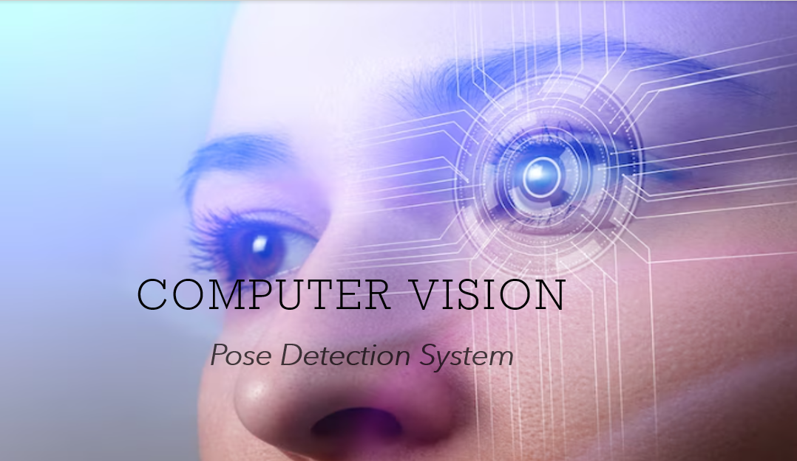
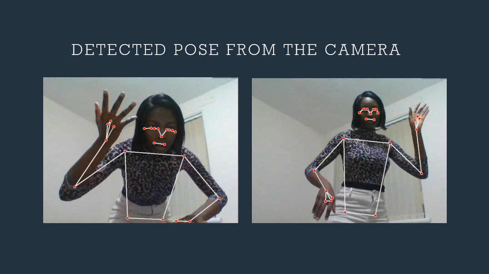

## Hand and Pose Detection
Welcome to the Hand and Pose Detection GitHub repository! This repository is your gateway to a powerful program that enables real-time detection of hand gestures and body poses. Explore the world of computer vision and human movement analysis through this comprehensive project.

Understanding human movements and gestures is a crucial aspect of various applications, from sign language recognition to fitness tracking. This repository offers an advanced program that utilizes computer vision techniques to detect hands and body poses. Whether you're a researcher, developer, or enthusiast, this project provides insights into the fascinating realm of human-computer interaction.

Real-Time Detection: Discover a program that can analyze movement in real time, accurately detecting and tracking hand movements and body poses.

Gesture Recognition: Unlock the potential to recognize specific hand gestures, allowing you to design applications that respond to dynamic interactions.

Pose Estimation: Dive deep into the realm of pose estimation, understanding how the program identifies and tracks various body positions. 
Happy Viewing!

 

 

